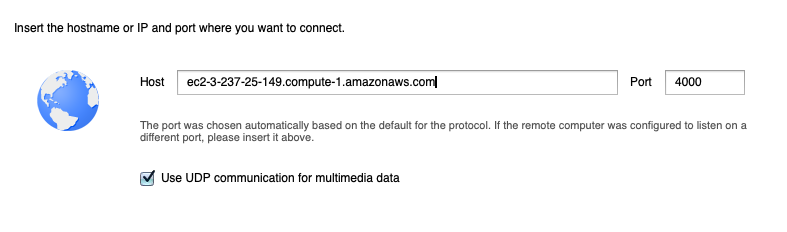
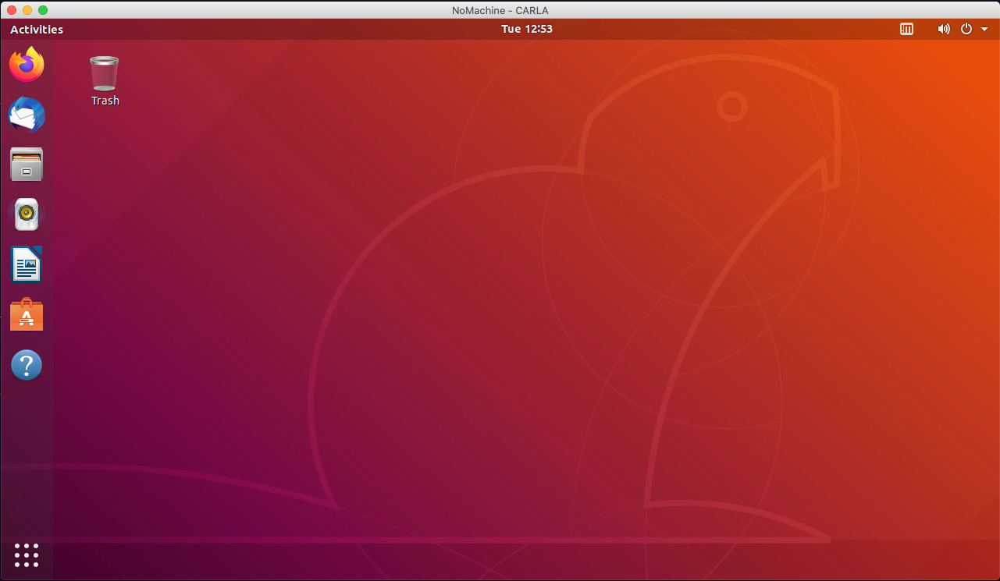

# CARLA Desktop

This repository provides instructions for setting up an Amazon EC2 virtual machine to run [CARLA](http://carla.org), the open-source simulator for autonomous driving research. 

## Prerequisites

* An AWS account
* About 20 minutes of free time on your hands

## What you'll accomplish

By following the steps below, you will

* Launch and configure a virtual machine on Amazon Web Services (AWS) (~10 minutes)
* Install CARLA (~10 minutes)
* Simulate

When you've completed these steps, you'll have a working CARLA environment.


## Changelog

* Feb 2020 - CARLA 0.9.5 instructions
* Mar 2020 - Updated to use CARLA 0.9.8 (and simplified the process)

# Get started

## Launch and configure a virtual machine on AWS

We'll use the [AWS Deep Learning AMI for Ubuntu 18.04](https://docs.aws.amazon.com/dlami/latest/devguide/ubuntu18-04.html).

* From the AWS [EC2 console](https://console.aws.amazon.com/ec2/v2/), click the **Launch Instance** button, then click on the "AWS Marketplace" tab in the left navigation.
* In the search box, search for "AWS Deep Learning AMI Ubuntu", then click the **Select** button.


* This AMI is optimized for GPU applications. Use the wizard to follow the steps to launch your image on an EC2 machine. Currently, the most cost-effective instance type for running CARLA is the __g4dn.xlarge__, which is $0.526/hr as of March 2020. Make sure to stop the instance when not in use to avoid high charges. 

### Modify the EC2 Security Group

Modify the EC2 security group for your instance. Allow TCP access on ports 22 and 4000 from your IP address. This will allow you to SSH into your machine and use NoMachine to connect to the desktop and view CARLA simulations.


### Test initial installation

After the AMI boots, SSH into the machine and check `nvidia-smi` to confirm you have NVIDIA drivers by default. If you don't see something similar to the below, you've launched the wrong instance.

```
+-----------------------------------------------------------------------------+
| NVIDIA-SMI 440.59       Driver Version: 440.59       CUDA Version: 10.2     |
|-------------------------------+----------------------+----------------------+
| GPU  Name        Persistence-M| Bus-Id        Disp.A | Volatile Uncorr. ECC |
| Fan  Temp  Perf  Pwr:Usage/Cap|         Memory-Usage | GPU-Util  Compute M. |
|===============================+======================+======================|
|   0  Tesla T4            On   | 00000000:00:1E.0 Off |                    0 |
| N/A   45C    P8    16W /  70W |      0MiB / 15109MiB |      0%      Default |
+-------------------------------+----------------------+----------------------+

+-----------------------------------------------------------------------------+
| Processes:                                                       GPU Memory |
|  GPU       PID   Type   Process name                             Usage      |
|=============================================================================|
|  No running processes found                                                 |
+-----------------------------------------------------------------------------+
```

## Install NoMachine

NoMachine allows you to access the virtual machine render the simulation much faster than VNC. 

### First, install the server on the virtual machine:

```
cd ~
wget https://download.nomachine.com/download/6.11/Linux/nomachine_6.11.2_1_amd64.deb
sudo dpkg -i no*.deb
rm no*.deb
```

### Install a NoMachine client

Visit [https://www.nomachine.com/](https://www.nomachine.com/) to download a NoMachine client for your OS.

## Configure Ubuntu

### (Optional) Set an ubuntu password:

Setting a password is useful if you're going to be in the Ubuntu desktop a lot.

    sudo passwd ubuntu

### Install Ubuntu desktops

You'll use an Ubuntu desktop to give you GUI access to your CARLA simulation:

```
sudo apt-get update && sudo apt-get upgrade -y
sudo apt-get install -y ubuntu-desktop gnome-panel gnome-settings-daemon metacity nautilus gnome-terminal xfce4 xterm
export DEBIAN_FRONTEND=noninteractive
sudo apt-get install -y lubuntu-desktop
```

## Install CARLA 0.9.8

Install CARLA 0.9.8 per the instructions at [https://carla.readthedocs.io/en/latest/start_quickstart/](https://carla.readthedocs.io/en/latest/start_quickstart/):

```
sudo apt-key adv --keyserver keyserver.ubuntu.com --recv-keys 304F9BC29914A77D
sudo add-apt-repository "deb [arch=amd64 trusted=yes] http://dist.carla.org/carla-0.9.8/ all main"
sudo apt-get update
sudo apt-get install carla-simulator
```

### Create a CARLA environment in Conda

Conda will allow you to run multiple Python projects without worrying about dependency collisions, and isolate the Python libraries CARLA needs:

```
cd ~
conda create -n carla python=3.5
source activate carla
```

### Install CARLA Python requirements

Install the required libraries needed to run the simulation:

```
pip install pygame numpy
```

### Reboot and login with NoMachine

First, reboot:

    sudo reboot
    
After a few minutes, create a connection with the NoMachine client, using the Public DNS address of your EC2 machine:



* Choose Password authentication
* Leave "Don't use a proxy" selected
* Name your connection, then press done

When you've created the connection, open it, and login with your "ubuntu" username and password. After a few moments, you'll be presented with the Ubuntu login screen. After you sign in answer a few questions to setup your system, you'll be taken to your Ubuntu desktop:



## Run the CARLA Simulation

### Start the CARLA Server

Open Ubuntu's terminal application. In one window, start CARLA:

    cd /opt/carla-simulator/bin
    SDL_VIDEODRIVER=offscreen ./CarlaUE4.sh

For some machines, the command doesn't seems to work so you acn try an alternate command that may do the trick for you.
```
    cd /opt/carla-simulator/bin
    DISPLAY= ./CarlaUE4.sh -opengl -carla-port=2000
```

No window will open yet, CARLA is just waiting for you to interact with it via the Python API. If you run into errors, I've found another reboot of the system usually fixes it.

### Launch the manual control script

In another terminal window (or tab), start the simulation:

    source activate carla
    cd /opt/carla-simulator/PythonAPI/examples
    python manual_control.py

This will bring up the CARLA simulation window. You can control your car with the `W,A,S,D` keys. Check the source for `manual_control.py` for ways to change or interact with your environment.

# You're finished and ready to simulate!


