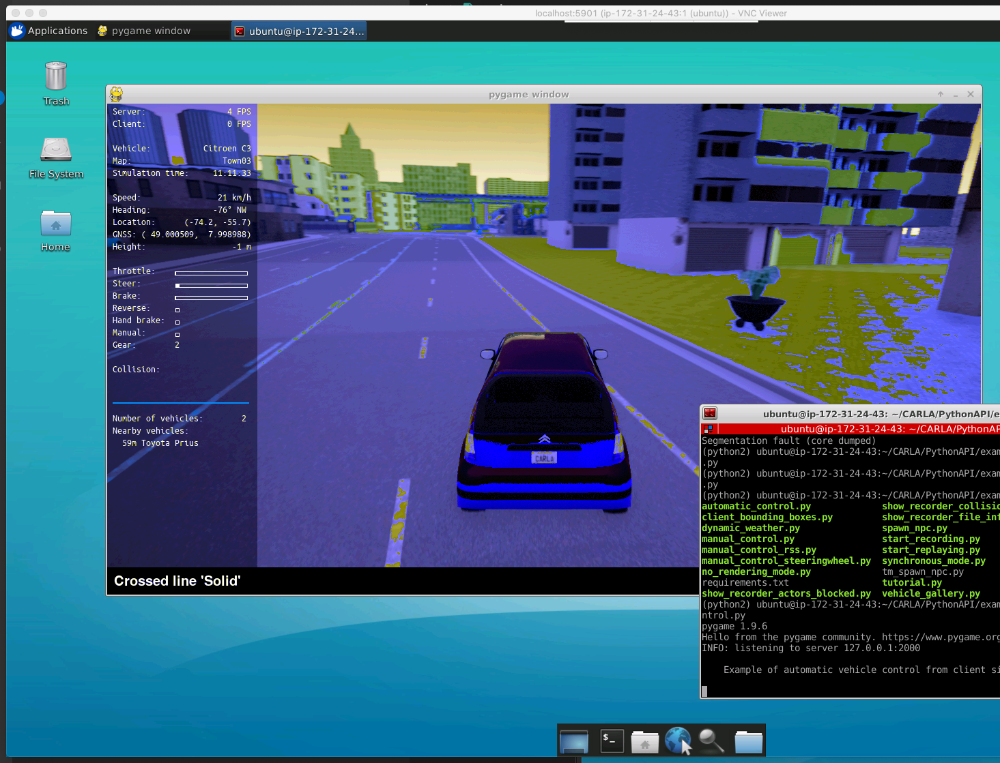

# CARLA Desktop

[CARLA](http://carla.org), the open-source simulator for autonomous driving research, is notoriously painful to setup (as of Jan, 2020). The documentation is filled with version conflicts, outdated examples, and innacurate instructions. 

This repository provides easy-to-follow instructions for getting a CARLA environment up and running using a GPU-enabled virtual machine on AWS.

## Prerequisites

* An AWS account
* About 30 minutes of free time on your hands

## What you'll accomplish

By following the steps below, you will

1) [Launch a GPU-based virtual machine on Amazon Web Services](./Step1-AWS.md) (~15 minutes)
2) [Install CARLA](./Step2-CARLA.md) (~10 minutes)
4) [Simulate!](./Step3-Simulate.md)

When you've completed these steps, you'll have a working CARLA environment.

## After a successful install, come back here to easily relaunch your server and client:

Once you've gone through these steps, you can can open two terminals and run the following scripts to easily kick off your simulation:

### Server

Copy [./server.sh](server.sh) and [./client.sh](client.sh) to your EC2 instance, then:

    ssh -i "your.pem" ubuntu@ec2-11-222-33-444.compute-1.amazonaws.com
    bash server.sh

### Client

    ssh -i "your.pem" -L 5901:localhost:5901 ubuntu@ec2-11-222-33-444.compute-1.amazonaws.com
    bash client.sh

### VNC

Now you're ready to view the output from your EC2 machine. Open your VNC client to localhost:5901 to begin interacting!
