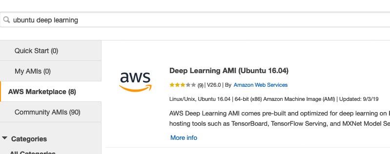
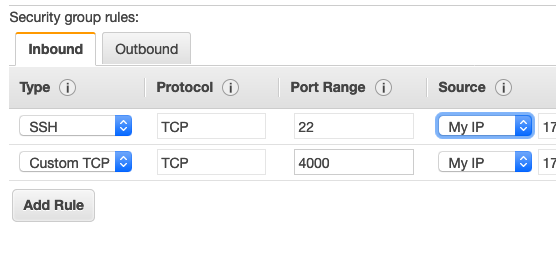
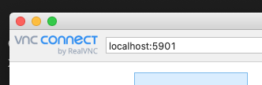

## Create a GPU-based VM on AWS

* From the [EC2 console](https://console.aws.amazon.com/ec2/v2/), click the **Launch Instance** button, then click on the "AWS Marketplace" tab in the left navigation.
* In the search box, search for "ubuntu deep learning", then click the **Select** button.



* Use the Ubuntu 16.04 version. This AMI is optimized for graphical and deep learning applications, and comes with many deep learning frameworks. What we really want out of it are pre-installed NVIDIA drivers. [You can read more about the AMI here.](https://aws.amazon.com/marketplace/pp/B077GCH38C?ref=cns_srchrow) 

* Use the wizard to follow the the steps to launch your image on an EC2 machine. Currently, the most cost-effective instance type for running CARLA is the __g3s.xlarge__, which is $0.75/hr as of Jan. 2020. Make sure to stop the instance when not in use, to avoid high charges. 

* When the wizard brings you to storage, you will need at least 150GB of space.

* You will need to open the follwing inbound ports when creating a security group:

    TCP port 22 for SSH
    TCP ports 2000-2002 for CARLA server



For each of those ports, take care to make the source IP as specific as possible, especially for SSH. In most cases, you should only enable access to your IP by using the "My IP" option when creating inbound rules.

## Setup your VM

* Once your VM has launched, SSH into it. Run the following commands to configure your machine:

```
# VNC and xterm
sudo apt-get update && sudo apt-get upgrade -y
sudo apt-get install -y ubuntu-desktop gnome-panel gnome-settings-daemon metacity nautilus gnome-terminal xfce4 vnc4server xterm

# Install lubuntu
export DEBIAN_FRONTEND=noninteractive
sudo apt-get install -y lubuntu-desktop

# OpenGL
sudo apt-get install -y freeglut3-dev mesa-utils

# VirtualGL
wget https://sourceforge.net/projects/virtualgl/files/2.6.3/virtualgl_2.6.3_amd64.deb/download -O virtualgl_2.6.3_amd64.deb
sudo dpkg -i virtualgl*.deb
rm virtualgl*.deb

# TurboVNC
wget https://sourceforge.net/projects/turbovnc/files/2.1.1/turbovnc_2.1.1_amd64.deb/download -O turbovnc_2.1.1_amd64.deb 
sudo dpkg -i turbovnc*.deb
rm turbovnc*.deb

# Extra packages
sudo apt install -y libxrandr-dev

# Clean up
sudo apt-get clean && sudo apt-get autoremove && sudo rm -r /var/lib/apt/lists/*
```

## Connect with a VNC Client

Log out of the instance, then log back in with port forwarding, substituting the `your.pem` and `ec2-11-222...` portion below with your key and the IP address of your EC2 instance

    ssh -i "your.pem" -L 5901:localhost:5901 ubuntu@ec2-11-222-33-444.compute-1.amazonaws.com

### Start the VNC server

Any time you want to connect via VNC remotely, you'll need to use the following command. Let's run it now:

    /opt/TurboVNC/bin/vncserver -geometry 1920x1080

### Connect to your EC2 server with a VNC client

Your EC2 server is now listening for connections. Use a VNC client (like RealVNC or VNC Viewer) to connect with your server. Because we forwarded port 5901, we use that port to connect to. Enter "localhost:5901" into your VNC client's address and connect.



This should bring up an empty ubuntu destkop (or black window). Back in your terminal where you launched `/opt/TurboVNC/bin/vncserver`, run

    export DISPLAY=:1 # if your vncserver started in DISPLAY :1
    
Then, try to run a graphical program, like `xeyes`:

    xeyes
    
In your blank window you should now see a pair of eyes that can follow the mouse around. If you see the eyes, you're ready for [Step 2-Install CARLA](Step2-CARLA.md).

